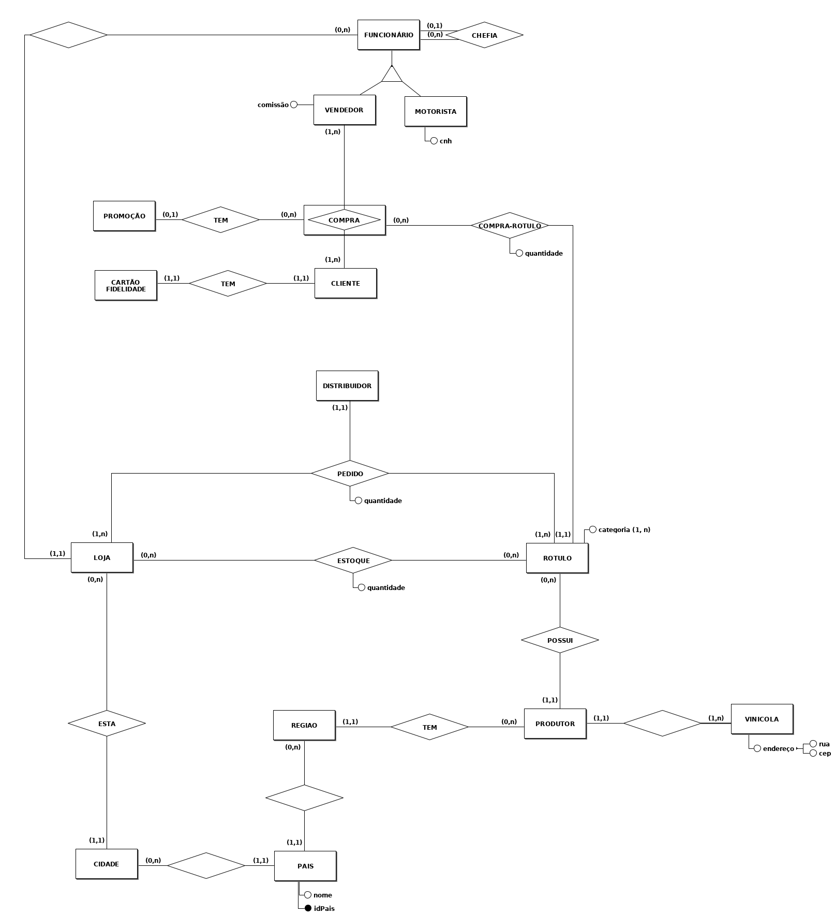
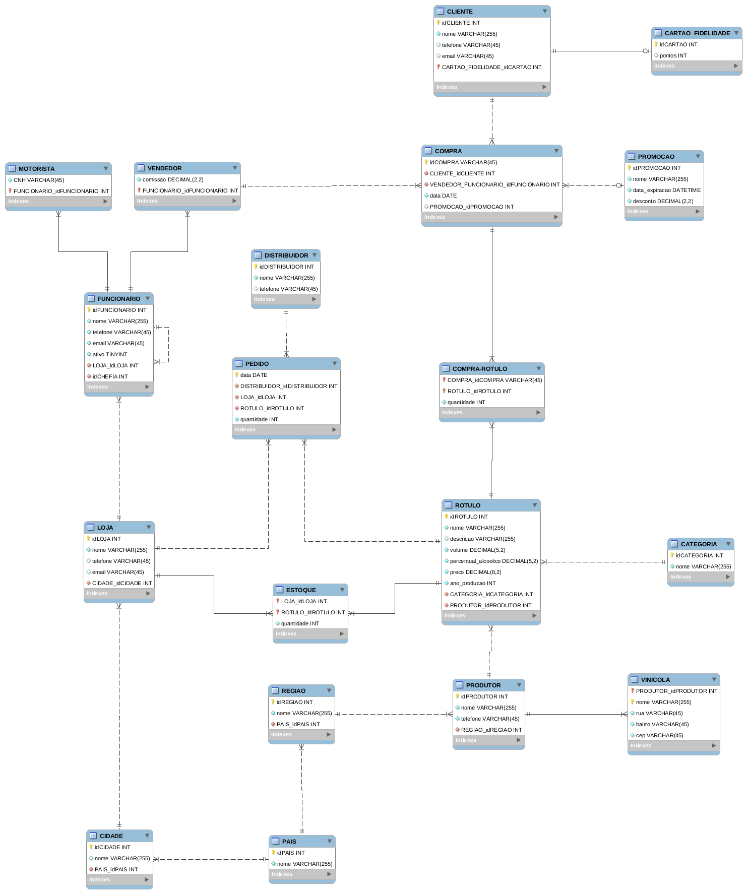

# WineStore

Para os propósitos desse trabalho, vamos assumir uma rede de lojas de vinhos com várias filiais em cidades diferentes e em diversos países. Portanto, armazenaremos informações referentes aos rótulos de vinhos, às lojas e aos fornecedores. **Adicionar informaçoes sobre clientes e pedidos caso às utilizemos**

Uma categoria de vinhos pode estar associada a nenhum ou vários rótulos, e um rótulo sempre possuirá uma categoria. Um rótulo sempre será produzido por um produtor, mas um produtor pode produzir vários rótulos. Vinhos são produzidos em regiões específicas por produtores específicos, logo, devemos registrar a região de cada produtor. Uma região pode possuir nenhum ou vários produtores de vinho, enquanto que cada produtor de vinho deve estar obrigatoriamente vinculado a uma e somente uma região. Por sua vez, cada região estará localizada em somente um país, mas um país pode possuir várias regiões produtoras de vinhos.

Cada filial da rede de lojas poderá estar localizada em várias cidades de vários países. Assim, um país estará associado a nenhuma ou várias cidades, mas cada cidade sempre estará associada a um país. Em cada cidade cadastrada teremos nehuma ou várias filiais, mas cada filial obrigatoriamente estará localizada em uma cidade. Cada filial terá em seu estoque nenhum ou vários rótulos, e cada rótulo pode estar em nenhuma ou em várias filiais. 

Pedidos são feitos pelas filiais através de funcionários à fornecedores específicos. Cada pedido tem um, e apenas um fornecedor, mas um fornecedor está associado a nenhum ou vários pedidos.

